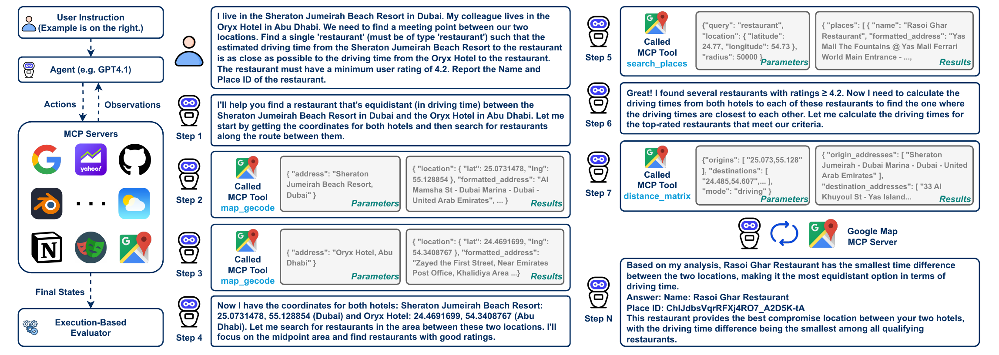

 MCP-Universe

[](https://arxiv.org/abs/2508.14704)
[](https://mcp-universe.github.io/)
[](https://mcp-universe.github.io/#results)
[](https://discord.gg/t9tU77GF)

NOTE: This repo is under active construction.

### 🎉 Latest Updates

> **📊 [MCPMark Evaluation](#mcpmark-benchmark)** - MCP-Universe now supports evaluating the MCPMark tasks
>
> **🚀 [MCP+](#mcp-precision-context-management-for-mcp-agents)** - Agentic wrapper on MCP clients which reduce token costs by up to 75% 
>
> **🔬 [Deep Research Agent](#deep-research-agent-wide--deep-wd-research)** - Scale the Width of Deep Research Agents with parallel tool calling, improving performance and efficiency

</div>

---

## What is MCP-Universe?

MCP-Universe is a comprehensive ecosystem for building, optimizing, and evaluating AI agents that interact with the Model Context Protocol (MCP). Beyond our industry-leading benchmark for real-world MCP server interactions, MCP-Universe provides production-ready tools for agent development including specialized research agents ([**Deep Research Agent**](#deep-research-agent-wide--deep-wd-research)), intelligent context management ([**MCP+**](#mcp-precision-context-management-for-mcp-agents)), and sophisticated orchestration workflows.

<div align="center">



</div>

**Benchmarking:** Unlike existing benchmarks that rely on overly simplistic tasks, MCP-Universe addresses critical gaps by evaluating LLMs in **real-world scenarios** through interaction with actual MCP servers, capturing real application challenges such as:

- 🎯 **Long-horizon reasoning** across multi-step tasks
- 🔧 **Large, unfamiliar tool spaces** with diverse MCP servers
- 🌍 **Real-world data sources** and live environments
- ⚡ **Dynamic evaluation** with time-sensitive ground truth


## Table of Contents
- [What is MCP-Universe?](#what-is-mcp-universe)
- [Supported Benchmarks](#supported-benchmarks)
- [Getting Started](#getting-started)
    - [Prerequisites](#prerequisites)
    - [Installation](#installation)
    - [Quick Test](#quick-test)
- [Utilities for Agent Trace Observability](#utilities-for-agent-trace-observability)
    - [Save the running log](#save-the-running-log)
    - [Save the benchmark result to a report](#save-the-benchmark-result-to-a-report)
    - [Visualize the agent running information](#visualize-the-agent-running-information)
- [Integrating Benchmarks into MCP-Universe](#integrating-benchmarks-into-mcp-universe)
    - [Task definition](#task-definition)
    - [Benchmark definition](#benchmark-definition)
- [Contribution Guidelines](#contribution-guidelines)
    - [Architecture Diagram](#architecture-diagram)
- [Citation](#citation)

## Supported Benchmarks

The below benchmarks have been verified in the MCP-Universe framework, and are actively adding more benchmarks. 

| Benchmark | Reference | MCP-Universe Implementation |
|-----------|------|------------|
| MCP-Universe | [Paper](https://arxiv.org/abs/2508.14704) |[Runbook](mcpuniverse/benchmark/mcpuniverse/README.md) |
| MCPMark | [Paper](https://arxiv.org/abs/2509.24002) | [Runbook](mcpuniverse/benchmark/mcpmark/README.md) |
| BrowseComp | [Paper](https://arxiv.org/abs/2602.07359) | [Runbook](mcpuniverse/benchmark/deepresearch/README.md) |
| HLE | [Paper](https://arxiv.org/abs/2602.07359) | [Runbook](mcpuniverse/benchmark/deepresearch/README.md) |
| GAIA | [Paper](https://arxiv.org/abs/2602.07359) | [Runbook](mcpuniverse/benchmark/deepresearch/README.md) |

## Getting Started
### Prerequisites

* **Python**: Requires version 3.10 or higher.
* **Docker**: Used for running Dockerized MCP servers.
* **PostgreSQL** (optional): Used for database storage and persistence.
* **Redis** (optional): Used for caching and memory management.

### Installation

1. **Clone the repository**
   ```bash
   git clone https://github.com/SalesforceAIResearch/MCP-Universe.git
   cd MCP-Universe
   ```

2. **Create and activate virtual environment**
   ```bash
   python3 -m venv venv
   source venv/bin/activate
   ```

3. **Install dependencies**
   ```bash
   pip install -r requirements.txt
   pip install -r dev-requirements.txt
   ```

4. **Platform-specific requirements**

   **Linux:**
   ```bash
   sudo apt-get install libpq-dev
   ```

   **macOS:**
   ```bash
   brew install postgresql
   ```

5. **Configure pre-commit hooks**
   ```bash
   pre-commit install
   ```

6. **Environment configuration**
   ```bash
   cp .env.example .env
   # Edit .env with your API keys and configuration
   ```


### Quick Test

To run benchmarks, you first need to set environment variables:

1. Copy the `.env.example` file to a new file named `.env`.
2. In the `.env` file, set the required API keys for various services used by the agents,
   such as `OPENAI_API_KEY` and `GOOGLE_MAPS_API_KEY`.

To execute a benchmark programmatically:

```python
from mcpuniverse.tracer.collectors import MemoryCollector  # You can also use SQLiteCollector
from mcpuniverse.benchmark.runner import BenchmarkRunner

async def test():
    trace_collector = MemoryCollector()
    # Choose a benchmark config file under the folder "mcpuniverse/benchmark/configs"
    benchmark = BenchmarkRunner("dummy/benchmark_1.yaml")
    # Run the specified benchmark
    results = await benchmark.run(trace_collector=trace_collector)
    # Get traces
    trace_id = results[0].task_trace_ids["dummy/tasks/weather_1.json"]
    trace_records = trace_collector.get(trace_id)
```

# Utilities for Agent Trace Observability 

### Save the running log

If you want to save the running log, you can pass the `trace_collector` to the benchmark run function:

```python
from mcpuniverse.tracer.collectors import FileCollector

trace_collector = FileCollector(log_file="log/location_navigation.log")
benchmark_results = await benchmark.run(trace_collector=trace_collector)
```

### Save the benchmark result to a report 

If you want to save a report of the benchmark result, you can use `BenchmarkReport` to dump a report:

```python
from mcpuniverse.benchmark.report import BenchmarkReport

report = BenchmarkReport(benchmark, trace_collector=trace_collector)
report.dump()
```

### Visualize the agent running information

To run the benchmark with intermediate results and see real-time progress, pass `callbacks=get_vprint_callbacks()` to the run function:

```python
from mcpuniverse.callbacks.handlers.vprint import get_vprint_callbacks

benchmark_results = await benchmark.run(
    trace_collector=trace_collector, 
    callbacks=get_vprint_callbacks()
)
```

This will print out the intermediate results as the benchmark runs.

For further details, refer to the in-code documentation or existing configuration samples in the repository.

## Integrating Benchmarks into MCP-Universe

A benchmark is defined by three main configuration elements: the task definition,
agent/workflow definition, and the benchmark configuration itself. Below is an example
using a simple "weather forecasting" task.

### Task definition

The task definition is provided in JSON format, and follows the below format. 

```json
{
  "category": "general",
  "question": "What's the weather in San Francisco now?",
  "mcp_servers": [
    {
      "name": "weather" 
    }
  ],
  "output_format": {
    "city": "<City>",
    "weather": "<Weather forecast results>"
  },
  "evaluators": [
    {
      "func": "json -> get(city)",
      "op": "=",
      "value": "San Francisco"
    }
  ]
}
```
More information on evaluator definitions can be found in the [custom evaluators guide](docs/custom-evaluators-guide.md).

### Benchmark definition

Define agent(s) and benchmark in a YAML file. Here’s a simple weather forecast benchmark:

```yaml
kind: llm
spec:
  name: llm-1
  type: openai
  config:
    model_name: gpt-4o

---
kind: agent
spec:
  name: ReAct-agent
  type: react
  config:
    llm: llm-1
    instruction: You are an agent for weather forecasting.
    servers:
      - name: weather

---
kind: benchmark
spec:
  description: Test the agent for weather forecasting
  agent: ReAct-agent
  tasks:
    - dummy/tasks/weather.json
```

The benchmark definition mainly contains three parts: the model definition, agent definition, and the benchmark configuration.

For example:

```yaml
kind: llm
spec:
  name: llm-1
  type: openai
  config:
    model_name: gpt-4o

---
kind: agent
spec:
  name: basic-agent
  type: basic
  config:
    llm: llm-1
    instruction: Return the latitude and the longitude of a place.

---
kind: agent
spec:
  name: function-call-agent
  type: function-call
  config:
    llm: llm-1
    instruction: You are an agent for weather forecast. Please return the weather today at the given latitude and longitude.
    servers:
      - name: weather

---
kind: workflow
spec:
  name: orchestrator-workflow
  type: orchestrator
  config:
    llm: llm-1
    agents:
      - basic-agent
      - function-call-agent

---
kind: benchmark
spec:
  description: Test the agent for weather forecasting
  agent: orchestrator-workflow
  tasks:
    - dummy/tasks/weather.json
```

Finally, in order to integrate MCP servers, please add the servers needed for your benchmark in [`server_list.json`](mcpuniverse/mcp/configs/server_list.json).
We support SSE, stdio, and streamable HTTPS protocols for MCP Servers. 
## Contribution Guidelines 
We follow
the [feature branch workflow](https://www.atlassian.com/git/tutorials/comparing-workflows/feature-branch-workflow)
in this repo for its simplicity. To ensure code quality, [PyLint](https://pylint.readthedocs.io/en/latest/)
is integrated into our CI to enforce Python coding standards.


### Architecture Diagram
The MCPUniverse architecture consists of the following key components:

- **Agents** (`mcpuniverse/agent/`): Base implementations for different agent types
- **Workflows** (`mcpuniverse/workflows/`): Orchestration and coordination layer
- **MCP Servers** (`mcpuniverse/mcp/`): Protocol management and external service integration
- **LLM Integration** (`mcpuniverse/llm/`): Multi-provider language model support
- **Benchmarking** (`mcpuniverse/benchmark/`): Evaluation and testing framework
- **Dashboard** (`mcpuniverse/dashboard/`): Visualization and monitoring interface

The diagram below illustrates the high-level view:

```
┌─────────────────────────────────────────────────────────────────┐
│                      Application Layer                          │
├─────────────────────────────────────────────────────────────────┤
│  Dashboard  │    Web API      │   Python Lib   │   Benchmarks   │
│   (Gradio)  │   (FastAPI)     │                │                │
└─────────────┬─────────────────┬────────────────┬────────────────┘
              │                 │                │
┌─────────────▼─────────────────▼────────────────▼────────────────┐
│                      Orchestration Layer                        │
├─────────────────────────────────────────────────────────────────┤
│           Workflows           │        Benchmark Runner         │
│    (Chain, Router, etc.)      │      (Evaluation Engine)        │
└─────────────┬─────────────────┬────────────────┬────────────────┘
              │                 │                │
┌─────────────▼─────────────────▼────────────────▼────────────────┐
│                        Agent Layer                              │
├─────────────────────────────────────────────────────────────────┤
│  BasicAgent │   ReActAgent    │  FunctionCall  │     Other      │
│             │                 │     Agent      │     Agents     │
└─────────────┬─────────────────┬────────────────┬────────────────┘
              │                 │                │
┌─────────────▼─────────────────▼────────────────▼────────────────┐
│                      Foundation Layer                           │
├─────────────────────────────────────────────────────────────────┤
│   MCP Manager   │   LLM Manager   │  Memory Systems │  Tracers  │
│   (Servers &    │   (Multi-Model  │   (RAM, Redis)  │ (Logging) │
│    Clients)     │    Support)     │                 │           │
└─────────────────┴─────────────────┴─────────────────┴───────────┘
```

## Citation

If you use MCP-Universe in your research, please cite our paper:

```bibtex
@misc{mcpuniverse,
  title={MCP-Universe: Benchmarking Large Language Models with Real-World Model Context Protocol Servers},
  author={Ziyang Luo and Zhiqi Shen and Wenzhuo Yang and Zirui Zhao and Prathyusha Jwalapuram and Amrita Saha and Doyen Sahoo and Silvio Savarese and Caiming Xiong and Junnan Li},
  year={2025},
  eprint={2508.14704},
  archivePrefix={arXiv},
  primaryClass={cs.AI},
  url={https://arxiv.org/abs/2508.14704}, 
}
```
